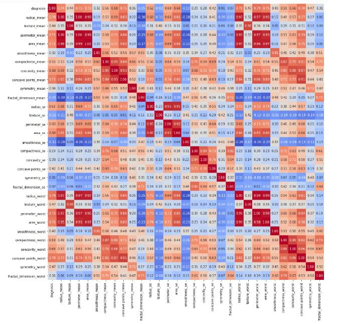

# Breast-Cancer-Diagnostic-Prediction
#1. Data Set Selection
For each cell, there are ten real-valued features are computed. As the description of the data says “The mean, standard error and “worst” or largest (mean of the three largest values) of these features were computed for each image, resulting in 30 features.

#2. Data Preprocessing

