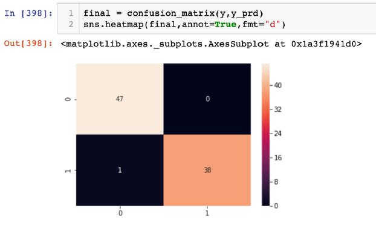

# Breast-Cancer-Diagnostic-Prediction

# 1. Data Set Selection

For each cell, there are ten real-valued features are computed. As the description of the data says “The mean, standard error and “worst” or largest (mean of the three largest values) of these features were computed for each image, resulting in 30 features.

# 2. Data Preprocessing

# 3.1 Approach1: Treat all 32 features together

From the Corelation Map, we know that some features like radius_mean, perimeter_mean and area_mean are highly related (nearly 0.99). So we only choose perimeter_mean. Similarly, we will choose perimeter_se, perimeter_worst, texture_mean, texture_se, texture_worst etc. Thus we wil have 18 feactures left.

# 3.2 Approach2: Treat features in three groups

Apply the same procedule to the Mean, SE, and Worst groups, we can get their highest score are 0.90, 0.84, 0.94 respecitvely

# 4. Comparing & Get final result

After comparing those 4 models, we will choose the approach 1 of logisticRegression model. When we apply it to test data, we can have a score of 0.99
